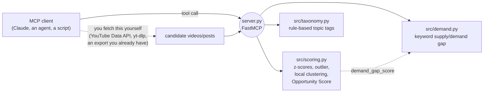

# youtube-intel-mcp

[](https://github.com/svx2027/youtube-intel-mcp/actions/workflows/tests.yml)

An [MCP](https://modelcontextprotocol.io) server that packages the
competitor-intelligence scoring engine from
[yt-competitor-swipe](https://github.com/svx2027/yt-competitor-swipe) as
tools any MCP client — Claude, another agent, a script — can call directly,
with no server-side network access and no API key.

You fetch the candidate videos however you like (the YouTube Data API,
yt-dlp, an export you already have); this server scores, tags, and clusters
them. It never fetches anything itself.

## Why package it this way

The source engine's scoring math (a blended Opportunity Score across six
signals) and its topic taxonomy are the reusable part — the part worth
handing to *any* agent working on *any* channel, not just the pipeline it
was built inside. An MCP server is the natural packaging for that: the
scoring logic becomes a tool call instead of a Python import, callable from
inside a Claude conversation, another agent's workflow, or a one-off script,
with a typed, documented interface instead of "go read score.py."

## Tools

| Tool | What it does |
|---|---|
| `score_candidates` | Blended 0-100 Opportunity Score: views-per-hour percentile, outlier multiple vs a channel baseline, engagement-velocity z-scores, demand gap, title-cluster convergence. Returns the input candidates annotated and sorted. |
| `compute_demand_gap` | Ranks a keyword list by how under-served it is (strong demand, thin or stale competitor supply) and attaches a `DEMAND_GAP` flag to genuinely under-served candidates. Feed its output into `score_candidates` for the full blend. |
| `tag_topics` | Rule-based topic tagging from a title-hint taxonomy you supply, with an optional fallback to labels from an earlier human/model judgment pass. Never guesses; leaves a candidate untagged rather than inventing a label. |
| `cluster_titles` | Groups a list of titles into subtopic clusters by their rarest shared significant token — deterministic, no external model call. |

Full argument shapes and return values are in each tool's docstring in
`server.py` (also what an MCP client sees when it lists tools).

## Quickstart

```bash
git clone https://github.com/svx2027/youtube-intel-mcp.git
cd youtube-intel-mcp
python3 -m venv .venv && source .venv/bin/activate
pip install -r requirements.txt
python3 server.py
```

That starts the server on stdio, ready for a desktop MCP client (Claude
Desktop, Claude Code) to connect.

### Streamable HTTP, for a remote or web client

```bash
python3 server.py --transport streamable-http --port 8000
```

A client now connects over HTTP at `http://127.0.0.1:8000/mcp` instead of
spawning the process on stdio — the same four tools, same inputs and
outputs, different transport. `demo/http_client_demo.py` is a real MCP
client exercising this end to end (initialize → list tools → call
`score_candidates`) over an actual socket; `demo/session_transcript.txt` is
a captured run of it against exactly the command above, if you want to see
the exchange without starting anything yourself:

```bash
# terminal 1
python3 server.py --transport streamable-http --port 8000
# terminal 2
python3 demo/http_client_demo.py
```

**No hosted demo endpoint.** The natural next step — a Vercel (or
equivalent) deployment of this ASGI app so you can point a client at a URL
with nothing running locally — isn't live. The build environment this repo
is maintained from has outbound network access to GitHub, PyPI and npm
only; every hosting provider tried (Vercel, Fly.io, Render, Railway,
Cloudflare Workers, ngrok, Hugging Face Spaces) is blocked at the network
policy layer, not by anything about the app itself. `mcp.streamable_http_app()`
returns a standard Starlette ASGI app (`server.mcp.streamable_http_app()`),
so deploying it anywhere that runs Python ASGI apps is the same exercise as
deploying any other FastAPI/Starlette service — nothing in this repo is
Vercel-specific or missing for that step.

To call a tool without any MCP client at all — every tool is also a plain,
directly callable Python function:

```python
from server import score_candidates

result = score_candidates([
    {"title": "Best kettlebell for beginners", "vph": 12.0,
     "channel_id": "c1", "relation": "direct"},
    {"title": "Kettlebell workout for beginners", "vph": 400.0,
     "channel_id": "c2", "relation": "direct"},
])
print(result["candidates"][0]["title"], result["candidates"][0]["opportunity_score"])
```

`config.example.yaml` has the full weights/thresholds/taxonomy shape each
tool accepts — copy the section you need into your own call, or load the
whole file and pass it straight through.

## Architecture



Every tool call is stateless: no cache, no ledger, no config file read from
disk inside the server. Everything the source engine read from a file
(baselines, the seasonal calendar, a multi-day history ledger) is instead a
plain argument here, or a signal this scaffold doesn't expose yet (see
below) — a deliberate trade for a server any client can call without first
setting up that engine's full repo layout.

## Honest scope

This is a scaffold: the four tools above, not the full pipeline.

- **No fetching.** No YouTube Data API call, no yt-dlp, no vidIQ, no Gemini
  call happens inside this server. You bring the candidate data.
- **Clustering is local-only.** The source engine's optional Gemini-assisted
  clustering path isn't wired up here — `cluster_titles` always uses the
  same deterministic token-anchor method the source engine falls back to
  when Gemini is unavailable, so behavior here matches its documented,
  network-independent path.
- **No calendar-tailwind signal.** The source engine's sixth signal (does a
  title match an active seasonal-demand phase) depends on "today's date"
  and a calendar file; there's no `apply_calendar` tool yet, so the
  `calendar` weight in `score_candidates` always contributes 0. It's counted
  in the weights (so the other five still sum against the same total a
  caller of the source engine would expect) rather than silently dropped
  from the config shape.
- **No sleeper / new-format history signals.** Both depend on a multi-day
  ledger this stateless server doesn't keep. Not exposed; not silently
  half-implemented.
- **No hosted deployment.** Streamable HTTP transport works (see
  Quickstart), so a client can reach it over a network instead of spawning
  it on stdio — but there's no URL to point at yet; you still run the
  process yourself, just on `--transport streamable-http` instead of
  stdio. See the Quickstart section for exactly why no hosted endpoint is
  live and what deploying one would take.

## Tests

```bash
python3 -m unittest discover -s tests -v
```

48 tests, no network calls: the scoring math (z-scores, outlier fallback
order, local clustering, the blended score under custom weights), the
demand-gap signal (including the "alignment alone never flags" rule), rule-
based tagging, a set of server smoke tests confirming the MCP server
imports cleanly, registers exactly the four tools above, and — the one that
actually proves it works as an MCP server, not just as importable Python —
answers a real call routed through `mcp`'s own `call_tool` dispatch path,
plus the `--transport` CLI parsing and settings wiring for Streamable HTTP
(the HTTP transport itself is exercised over a real socket in
`demo/http_client_demo.py`, not in this no-network suite — see Quickstart).

## Related tools

- [yt-competitor-swipe](https://github.com/svx2027/yt-competitor-swipe):
  drawn from that repo's `src/score.py`, `src/keyword_demand.py`, and
  `src/taxonomy.py` — it runs the full pipeline this engine was built for
  (fetch, score, report, dashboard) end to end against a real niche. This
  repo exists for the case where you already have the candidate data and
  just want the scoring and tagging logic as a callable tool, from any
  MCP client.
- [yt-competitor-outlier-pipeline](https://github.com/svx2027/yt-competitor-outlier-pipeline):
  a different, keyless take on competitor outlier detection for a single
  channel, if you need the fetch layer too.

Full index of all public repos: [github.com/svx2027](https://github.com/svx2027).

## License

MIT, see [LICENSE](LICENSE).
